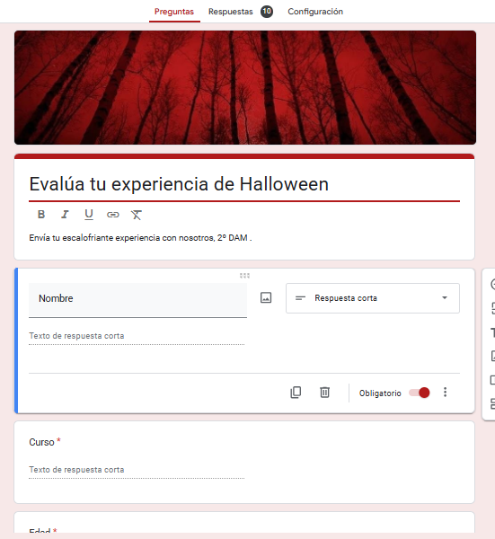
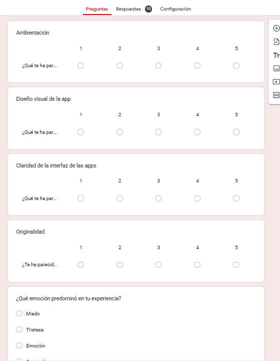
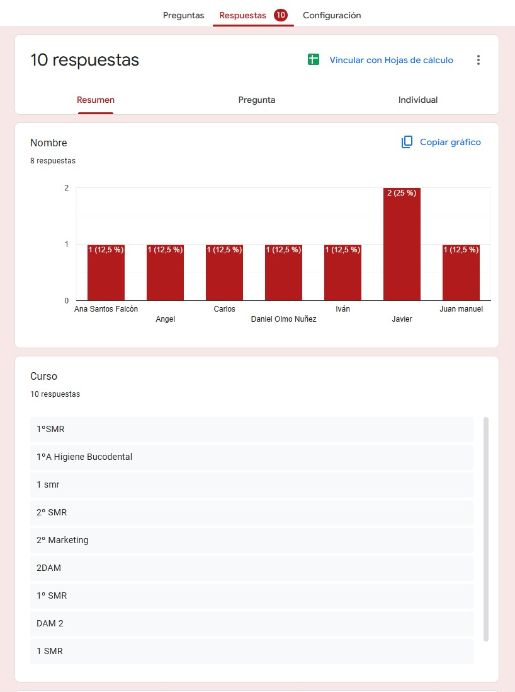
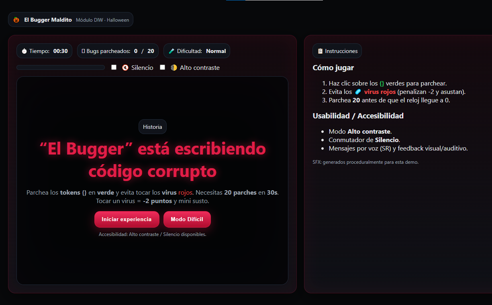
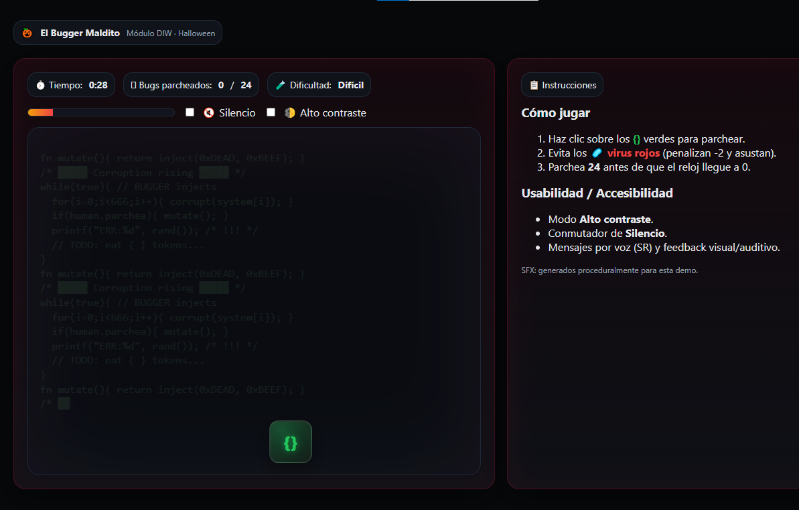

# EL BUGGER MALDITO — Túnel del Terror Digital 👻

Juego web para la actividad de Halloween del módulo **DIW**. Tu misión: **parchear tokens `{}`** verdes mientras evitas los **virus rojos 🦠**. Llega al objetivo antes de que el reloj y la **corrupción** devoren la interfaz. Incluye **modo Difícil**, **accesibilidad** (alto contraste y silencio), **feedback audiovisual** y **encuesta** al ganar.

---

## Índice
- [Demo / GIF](#demo--gif)
- [Capturas](#capturas)
  - [Formulario de encuesta](#formulario-de-encuesta)
  - [Aplicación](#aplicación)
- [Cómo jugar](#cómo-jugar)
- [Características](#características)
- [Accesibilidad](#accesibilidad)
- [Controles](#controles)
- [Lógica y mecánicas](#lógica-y-mecánicas)
- [Estructura del proyecto](#estructura-del-proyecto)
- [Ejecución local](#ejecución-local)
- [Configuración y personalización](#configuración-y-personalización)
- [Reflexión sobre usabilidad emocional](#reflexión-sobre-usabilidad-emocional)
- [Créditos y licencia](#créditos-y-licencia)

---

## Demo / GIF


---

## Capturas

### Formulario de encuesta
> El modal de encuesta aparece **solo al ganar** y abre el formulario en una pestaña nueva.

  



### Aplicación
> HUD con tiempo, progreso de corrupción, objetivo, dificultad y conmutadores de accesibilidad. Zona de juego con **tokens `{}`** (parcheables) y **virus** (penalización + mini susto).

  


---

## Cómo jugar
1. **Parchea** haciendo clic sobre los **`{}` verdes**.  
2. **Evita** los **virus rojos** (−2 puntos y mini susto).  
3. Llega al objetivo (**20 en Normal**, **24 en Difícil**) **antes de 00:30**.  
4. Si la **corrupción** alcanza el **100%**, pierdes.  
5. Al ganar verás la pantalla **“¡Has vencido al Bugger!”** y el **modal de encuesta**.

---

## Características
- 🎯 **Dos modos**: Normal y Difícil (más spawn, menos vida del bug, corrupción más rápida).
- ⏱️ **Ronda de 30s** con contador visible.
- 🧪 **HUD**: tiempo, puntuación/objetivo, dificultad, barra de corrupción con gradiente.
- 💬 **Toasts**: avisos contextuales (p. ej., “¡Virus! −2 puntos”).
- 🎧 **Sonido**: ambiente, parcheo, glitch sutil al aparecer entidades, victoria y scream (jumpscare).
- 🧠 **“Bugger typing”**: fondo con código corrupto animado (no seleccionable, solo lectura).
- 🪟 **Overlays** accesibles (Inicio, Victoria, Derrota) y **jumpscare** a pantalla completa.
- 📊 **Encuesta** (Google Forms) tras la victoria mediante un **modal centrado**.

---

## Accesibilidad
- 🌓 **Alto contraste** (toggle): `filter: contrast(1.25) saturate(1.1)`.
- 🔇 **Silencio** (toggle) con **volúmenes centralizados**.
- ⌨️ **Teclado**: entidades **focusables** con `role="button"` y activación con **Enter**/**Espacio**.
- 🔔 **ARIA**: HUD con `aria-live="polite"`, overlays con `role="dialog"`.
- 🧼 Prevención de **selecciones azules** en el fondo de código y limpieza de selección antes del jumpscare.

---

## Controles
- **Ratón:** clic sobre `{}` para sumar, evita los virus.  
- **Teclado:**  
  - **Enter/Espacio** sobre una entidad seleccionada para activarla.  
  - **Barra espaciadora** en overlays para (re)iniciar.  
- **Toggles:** Silencio / Alto contraste.  

En **Modo Difícil**, **clics fuera de objetivo** penalizan **−1**.

---

## Lógica y mecánicas
- **Objetivo**: `target = 20 (Normal) / 24 (Difícil)`.
- **Penalización virus**: −2 puntos + **mini susto** (flash rojo + glitch).
- **Spawn**: mezcla de `{}` y **virus** (~**28%** virus).  
- **Vida de entidad**: expira si no la clicas (sube corrupción).  
- **Corrupción**:  
  - Incremento pasivo por tick (más rápido en Difícil).  
  - Aumenta si **dejas escapar** un `{}`.  
  - Llega a **100%** ⇒ **derrota**.  
- **Encuesta**: solo se muestra en **victoria** (modal con dos botones).

---

## Estructura del proyecto
```
.
├─ index.html              # Archivo principal (HTML, CSS inlined, JS embebido)
├─ assets/
│  ├─ jumpscare.gif
│  ├─ ambient.wav
│  ├─ glitch.wav
│  ├─ patch.wav
│  ├─ scream.mp3
│  └─ win.wav
└─ resources/              # Capturas para el README
   ├─ form1.png
   ├─ form2.png
   ├─ bugger1.png
   ├─ bugger2.png
   └─ bugger-gif.png
```

> **Nota:** El README asume que las capturas están en `./resources/`.

---

## Ejecución local
1. **Clona / copia** el proyecto.  
2. Usa un **servidor estático** (necesario para servir audios/imágenes):  
   - **VS Code**: extensión *Live Server*.  
   - **Python**:
     ```bash
     # en la raíz del proyecto
     python -m http.server 5500
     # abre http://localhost:5500/
     ```
   - **Node**:
     ```bash
     npx serve .
     ```
3. Abre `index.html` en el navegador desde el servidor local.

---

## Configuración y personalización

### Dificultad y timings (JS)
```js
if (difficult) {
  // Difícil
  difficultyEl.textContent = 'Difícil';
  spawnEvery = 600;   // ms entre spawns
  bugLife    = 1050;  // ms de vida del bug {}
  corrupRate = 0.5;   // incremento pasivo por tick
  target     = 24;
} else {
  // Normal
  difficultyEl.textContent = 'Normal';
  spawnEvery = 850;
  bugLife    = 1350;
  corrupRate = 0.35;
  target     = 20;
}
```

### Porcentaje de virus
```js
const isVirus = Math.random() < 0.28; // 28% virus
```

### URL de la encuesta
```js
const SURVEY_URL = "https://docs.google.com/forms/d/e/1FAIpQLScGCHZOYoWkpwRhF1eT1w92QzmH-thBX_Ii9ZiCOFOECSFFQw/viewform?usp=sharing&ouid=116194055403336429299";
```

### Volúmenes centralizados
```js
function setVolumes() {
  const muted = muteToggle.checked;
  const BASE = muted ? 0 : 1;
  sfxGlitch.volume = 0.18 * BASE;
  sfxPatch.volume  = 0.45 * BASE;
  sfxWin.volume    = 0.60 * BASE;
  sfxScream.volume = 0.85 * BASE;
  amb.volume       = 0.16 * BASE;
}
```

---

## Reflexión sobre usabilidad emocional

Durante el desarrollo de *El Bugger Maldito*, aprendí cómo la **usabilidad emocional** transforma una interfaz en una **experiencia memorable**. No se trata solo de que el juego funcione, sino de **cómo hace sentir al jugador**: tensión, urgencia y recompensa. Pequeños detalles como el *glitch sonoro*, el parpadeo de la corrupción o el *susto* al fallar generan una respuesta emocional inmediata. También comprendí que el equilibrio entre **miedo y control** es clave: el usuario debe sentir riesgo sin frustrarse. Finalmente, integrar accesibilidad y feedback visual ayudó a que la emoción fuera **universal**, no exclusiva de quienes escuchan o ven perfectamente. Diseñar emociones es diseñar empatía.

---

## Créditos y licencia
- **Autoría**: Proyecto académico DIW — “El Bugger Maldito”.  
- **SFX/Audio**: generados **proceduralmente** para esta demo.  
- **Licencia**: uso educativo. Consulta al autor antes de reutilizar assets o código en producción.
